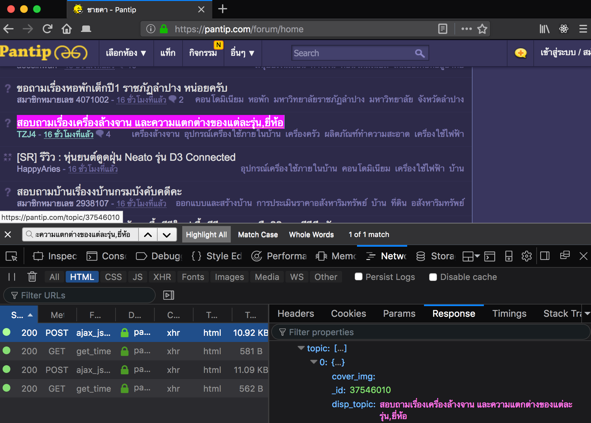
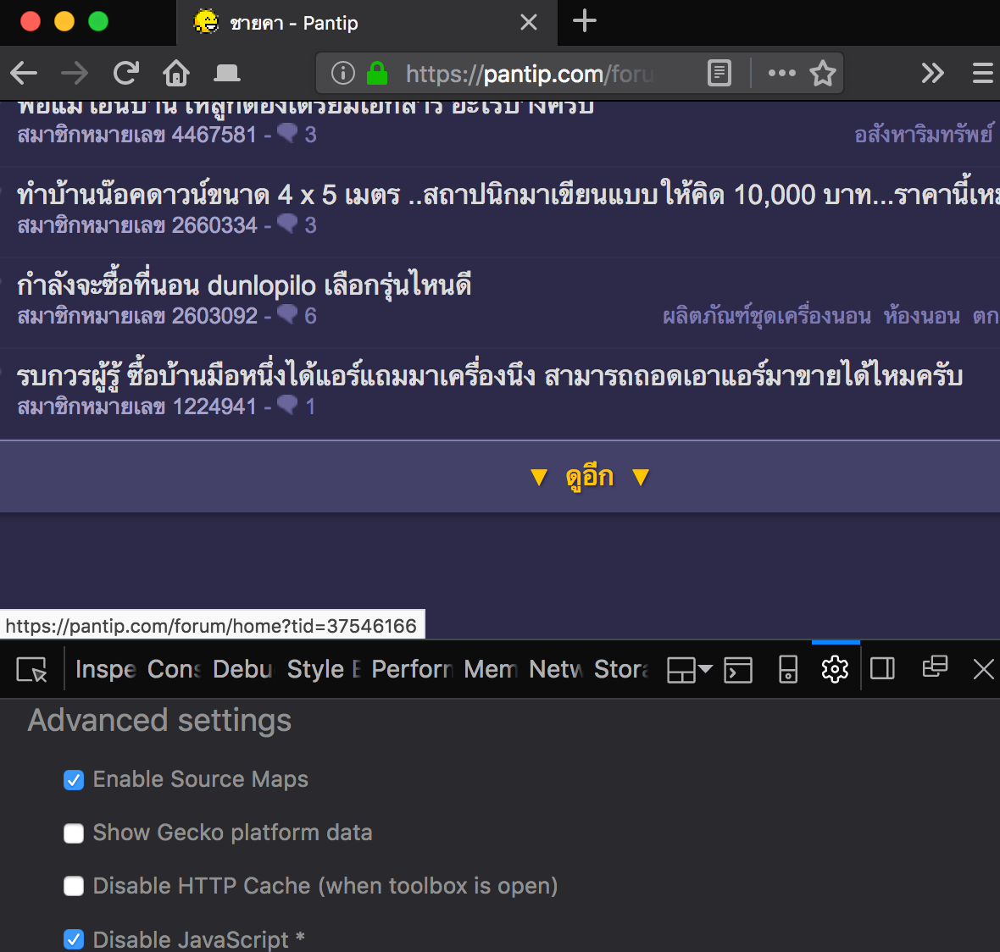

# Raw data collection

[*back to index*](../social-listening.md)

The *pantip.com* website is chosen due to its massive userbase in Thailand and heavy use as reference for Thai traditional media as the front page of the Internet.

## Pantip.com

    https://pantip.com/topic/<topic-id>

All pantip threads are formatted as above. Where the `<topic-id>` is a unique string of numbers representing a thread. Newer threads will have a higher topic-id. Nethier the content nor the tags within the post have any correlation with the `topic-id`.

Since we are only interested in product (real estate) mentions. We will need to find which may be related to our domain. Luckily Pantip has a browse feature for exploring threads with a certain tag or a group of tags. For example the "home" forum (`https://pantip.com/forum/home`) will list every thread with tags related to housing such as house, condominium, funiture etc.

Pantip has these special forum that are different from normal tags, as can they contain multiple tags inside them. A list can be found on the from page of pantip as shown on the image above.

Once the appropiate forum is open, a list of threads can be seen through the web browser. Fortunately this page has an infinite scroll feature. Meaning that the Javascript embedded within the page can request.

We can reverse engineer the ajax reqest to obtain the topics directly. Although this is a good way to obtain the topic-id. We used another solution.

By disabling Javascript, we've found a next page button for the forum page as shown above. The url format is as the following.

    https://pantip.com/forum/<forum-name>?tid=<topic-id>

Example

    https://pantip.com/forum/home?tid=37546166

The tid parameter tells the server which id was last shown, such that the returned (HTML rendered) page contains only threads posted before that topic (lower topic-id).

## Procedure Used

1. Crawl our topic-id. [code](https://github.com/BobbyL2k/unsuper-nlp/blob/master/web-crawler/standalone/v1/index.js)
2. Crawl thread HTML from topic id. [code](https://github.com/BobbyL2k/unsuper-nlp/blob/master/web-crawler/standalone/v1/page-crawl.js)
3. Parse HTML into JSON format. [code](https://github.com/BobbyL2k/unsuper-nlp/blob/master/data-processor/html-parser/pantip/index.js)

## Unused Features

### Comment Crawling

Comment crawling on pantip.com can be a bit challenging as the HTML loaded initialy does not contain the comments. Pantip relies on Javascript to load in the comments after the page is already loaded. Although comment crawling was implemented, it was not used. The proof of concept can be found [here](https://github.com/BobbyL2k/unsuper-nlp/blob/master/web-crawler/standalone/v1/test-comment.js). If you wish to use comment crawling, please refer to the "Packaged Module" section bellow.

### Packaged Module

The implemntation of the [newer crawler](https://github.com/BobbyL2k/unsuper-nlp/tree/master/web-crawler/standalone/v2) to crawl the comments along side the post was halted as the data from the posts alone was enough for the latter stages of this project. [A simple high-level crawler](https://github.com/BobbyL2k/unsuper-nlp/blob/master/web-crawler/standalone/v2/module/pantip.js) was implemented as a importable module. The module contains 3 APIs:

1. loading a thread raw HTML
2. loading a page of comments for a thread
3. loading all of the comments for a thread

## Alternatives

Before we arrived at the simple request crawler above we tried implementing a browser extension as a crawler.

### TODO