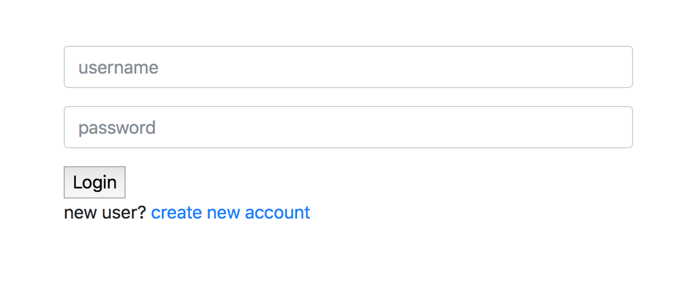
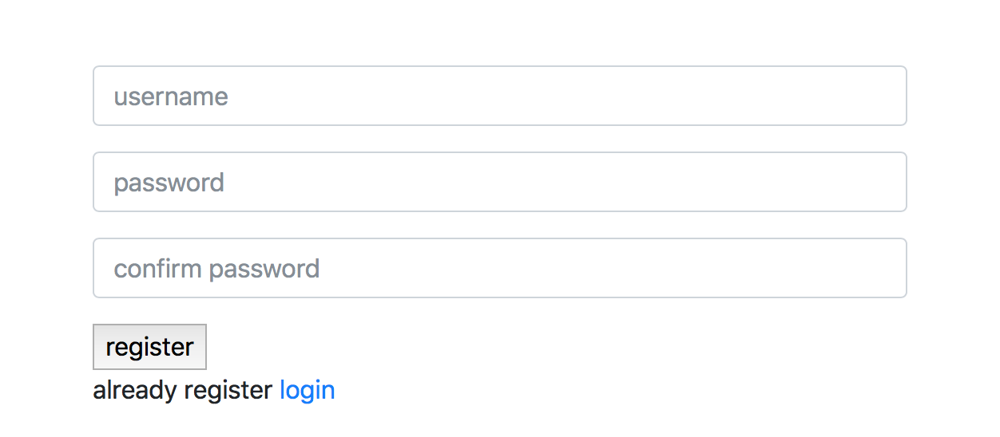
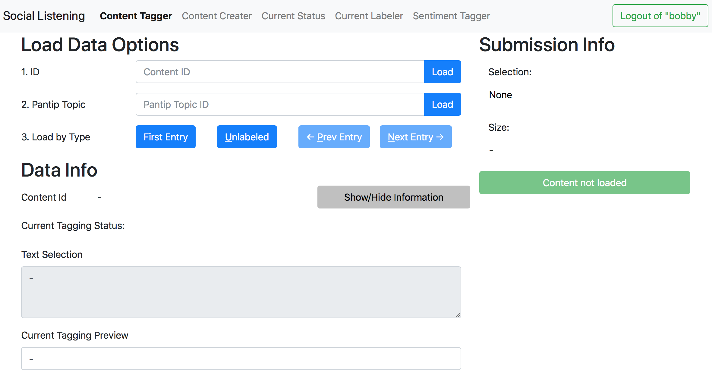
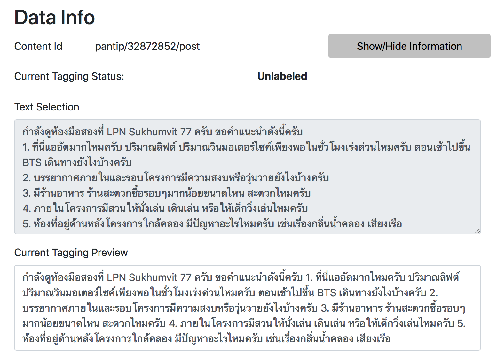
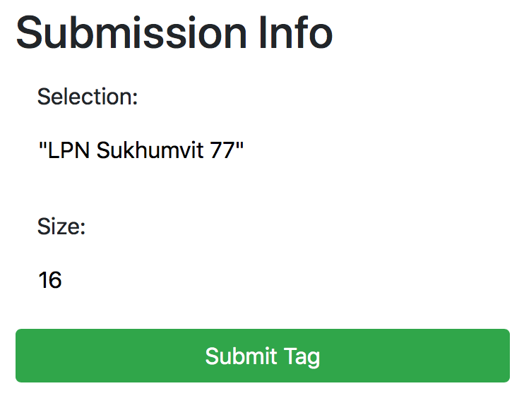
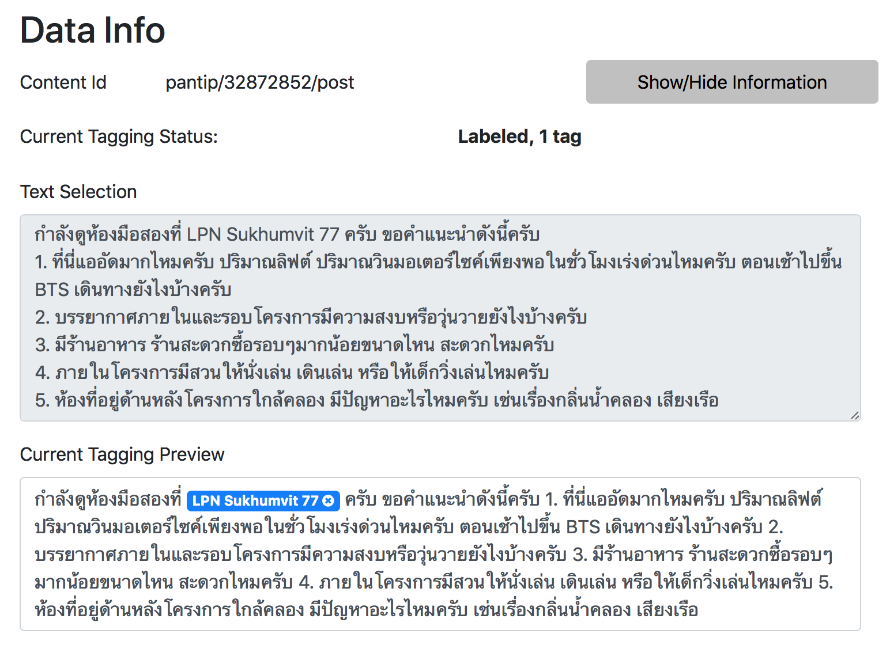
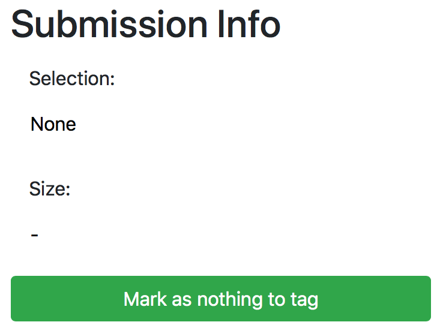
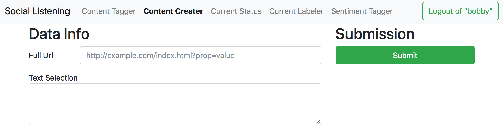
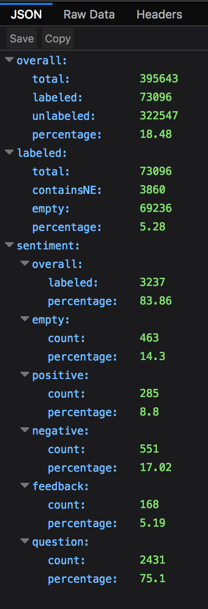

# Data Labeling

[*back to index*](../social-listening.md)

## Web Interface

Although our website is continuously updated during the development of this project, in this section, we will only primary on the compenents *used* in the final state of the system. The system can be split into 4 parts.

1. User authentication
2. Adding content
3. Named Entity tagging
4. Sentiment tagging

The website is located at http://139.59.43.241:3000. Any modern web browser should work with this website, if you experience any difficulty, please consider using FireFox as it is the primary browser tested to work with the website. This will be an overview of the website, for the website user manual and data labeling guidelines used during the project development, [please vist this link](https://docs.google.com/document/d/1Q3g9F2sX2KdC-GQzvaIML6waWi8ZDtLOZ8ogcwLWaFM/edit?usp=sharing).

### Usage

#### User Authentication

##### Login

The website by default redirects to the login page (http://139.59.43.241:3000/login). A preview of the login page can be seen bellow. Clicking the "create new account link" will redirect the user to the regristration page.

##### Regristration

The only the desired username and password is required for regristering. There is currently no account recovery method as the system is only used internally. A preview of the regristration page can be seen bellow.

#### Main Page

After a successful login, the page will redirect to the main user interface. The top bar shows a list of pages that can be used to add and label data on the database. The system by defaults lands on the Named Entity tagging page. The user is primary uses 4 pages: Content Tagger, Content Creater, Current Status, and Sentiment Tagger.

#### Content Tagger (Named Entity Tagging)

The Content Tagger is used for Named Entity tagging. The interface is divided into 3 parts

1. Data loading options
2. Data Information
3. Submission Information

##### Data loading options

The user has 6 options for loading a peice of data to label.

1. Loading by the internal ID
2. Loading by a pantip post by using the pantip ID
3. Loading the first entry in the database
4. Loading an entry in the database that is not labeled
5. Loading the next entry to the entry currently loaded in the database
6. Loading the entry before to the entry currently loaded in the database. The options are show in the image above.

Attempting to load any data that does not exist on the database, such as an invalid ID, loading a post that is previous to the first, loading a post next to the last post, or an unlabeled post whent all posts are already labeled will result in an error that will freeze the page.

The user will need to reload the page to continue using the website. This design was made to ensure that after a system upgrade, the user will reload the page and recive the updated client in case it is not compatible with the upgraded backend.

###### Loading by ID

Data can be catigorized by their ID. Pantip posts, Pantip titles, and posts added by the users.

Pantip posts

    pantip/<topic-id>/post

Pantip titles

    pantip/<topic-id>/title

User added posts

    <user-id>/<post-number>

###### Loading by Pantip ID

Specifying only the `<topic-id>` will load a pantip post with the proper ID. This option is the same as typing `pantip/<topic-id>/post` into the first option, load by id.

###### Loading the first entry

This option is mostly for debugging purposes. As loading the first post is not useful for labeling data.

###### Loading unlabeled data

This is the primary option the user will use to find unlabel data to label. The unlabel option will load data that is unlabeled, most likely to contain at least 1 Named Entity (based on a machine learning model), and is currenly not loaded by anyone else.

The system keeps note on which unlabeled post have been delivered to other users, to ensure that post delivered to each user is different. The system only keep tracks of posts delivered via the unlabeled option, post obtain for other loading options does not have this feature.

###### Loading post relative to the current post (next, prev)

This option is only enabled when a post is already loaded. While disabled the button will appeared greyed out.

##### Data Information & Tag Submission

Once the data is loaded the user can use this section to tag Named Entities, if any, in the body of text. A preview can be seen bellow.

The user can use their mouse to highlight the Named Entity location. After lifting the mouse button to for highlighting the text, the Submission Information section will be populated with information about the selected text. Once the user have confirmed that the selected text is correct, they can submit the tagging information by clicking the `Submit Tag` button.

After clicking the `Submit Tag` button, the tagging information will be sent to the server and the updated data is sent back to the client, showing the updated data, now with the new tag information. In our example, "LPN Sukhumvit 77" is tagged and a blue bounding box will cover the tagged peice of text. The `X` button can be used to click to remove the tag. A preview is shown bellow. The user can tagged an unlimited number of Named Entitiies.

If the data does not contain any Named Entity, the user can click the `Mark as nothing to tag`.

#### Content Creater

The Content Creater page is used by the user to add new content into the database. All user content will use the follow ID convention.

    <user-id>/<post-number>

Where the `<user-id>` will be the username of the user and the `<post-number>` will be the index of all of the content added by this user. A preview can be seen bellow.

Do note that the Pantip data is added directly into the database by a commandline tool and does not have a web interface.

#### Current Status

Clicking on this link will open a new tab in the user's web-browser to make a GET request to the /api/status route. Which will provide the user with the current labeling process in JSON format. A preview of the JSON from FireFox is shown bellow, the browser you use can cause the output to look differently.

#### Sentiment Tagger

The sentiment tagger is used to tag sentences with interesting content: positive descriptors, negative descriptors, feedbacks, and questions. The usage of the sentiment tagger is almost the same as the content tagger (Named Entity tagging page) with only one exception. The sentiment tagger keep only the range of the highlighted words, meaning two instances of the same type being tagged next to each other will result in only one longer tagged instance.